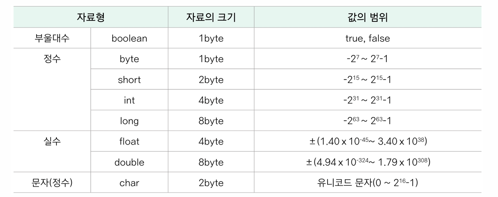

# JAVA의 특징

## 2. JAVA의 특징
Java는 다양한 기능을 제공하는 강력한 프로그래밍 언어입니다. 주요 특징은 다음과 같습니다.

- **객체지향**: Java는 캡슐화, 상속, 다형성과 같은 객체지향 프로그래밍(OOP) 개념을 지원합니다.
- **플랫폼 독립적**: "Write Once, Run Anywhere" 원칙을 따라, 한 번 작성된 Java 코드는 JVM(Java Virtual Machine)이 있는 모든 환경에서 실행될 수 있습니다. JVM은 자바의실행파일.class 를 실행하는 가상의(SW) 컴퓨터이며, JVM이 존재할 경우 운영체제에 상관없이 .class(java 실행 바이트코드 파일)을 실행할 수 있습니다.
- **멀티쓰레드 지원**: Java는 멀티쓰레딩을 지원하여 병렬 처리를 쉽게 구현할 수 있습니다.
- **분산처리 지원**: RMI(Remote Method Invocation) 및 다양한 네트워크 API를 통해 분산 시스템을 개발할 수 있습니다.
- **동적 로딩 지원**: 실행 시간에 필요한 클래스를 동적으로 로드하여 유연한 애플리케이션 개발이 가능합니다.
- **예외 처리 지원**: 강력한 예외 처리 메커니즘을 제공하여 안정적인 프로그램을 작성할 수 있습니다.
- **가비지 컬렉션**: 자동 메모리 관리를 지원하여 개발자가 직접 메모리를 해제할 필요 없이 효율적으로 관리됩니다.

## JAVA 실행환경
* JVM(Java Virtual Machine)은 Java 바이트 코드를 실행하는 가상 머신입니다.
* JRE(Java Runtime Environment)는 Java 프로그램을 실행하기 위한 환경을 제공합니다.
* JDK(Java Development Kit)는 Java 프로그램을 개발하기 위한 도구들을 제공합니다.

## JAVA 프로젝트 생성 및 실행

## JAVA 자바소스코드실행과정

__자바프로그램실행과정의4단계__
1. .java 소스 파일 생성
2. .class 바이트 코드 파일 생성
3. javac 커맨드를 통해 컴파일
4. JVM 기반의 메모리 할당, main() 메서드 실행

__JVM 이 사용하는 메모리영역__
- 메서드 영역(클래스/정적/상수), 
- 스택 영역
- 힙 영역

### JAVA 프로그램 세부 실행과정 
JDK -> JRE -> JVM -> OS -> Hardware

# `JAVA 자료형`

## 이름 규칙

- 변수명, 메서드명
    - 영문 소문자로시작
    - 2단어 이상 결합시에는새단어첫글자를대문자로(camel case)
    -  myWork, maxValue, bestPosition, ourClassNum
- 상수명
    - 대문자료 표기, 단어 여러 개결합시각각밑줄(_) 사용
    - MY_DATA

## JAVA 자료형 구분

- 기본 자료형(Primitive Type)
    - 정수형: byte, short, int, long
    - 실수형: float, double
    - 문자형: char
    - 논리형: boolean
- 참조 자료형(Reference Type)
    - 클래스, 인터페이스, 배열 등

## 자료형과 메모
- 메모리의3가지영역
    - 클래스(class)/정적(static)/상수(final)/메서드(method) 영역
    - 스택(stack) 영역: 변수 저장
    - 힙(heap) 영역: 객체 저장리

